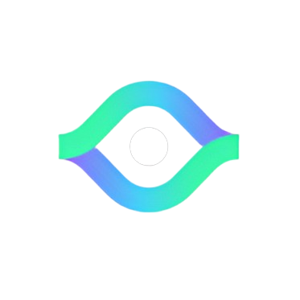
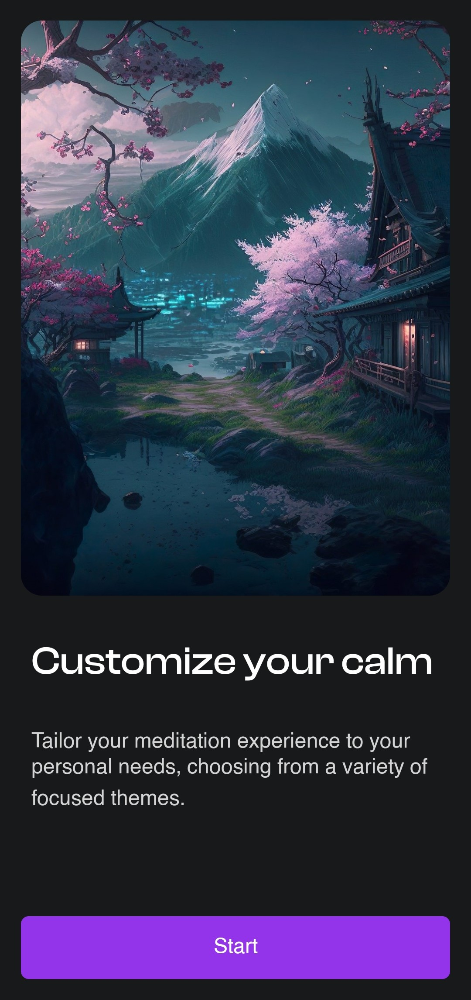
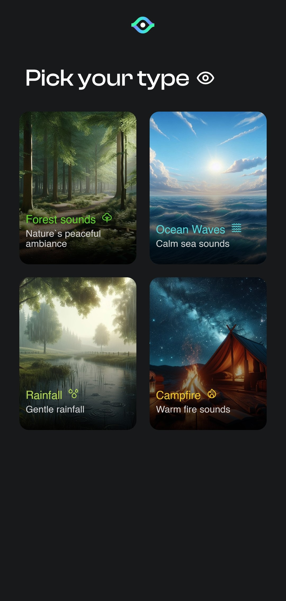
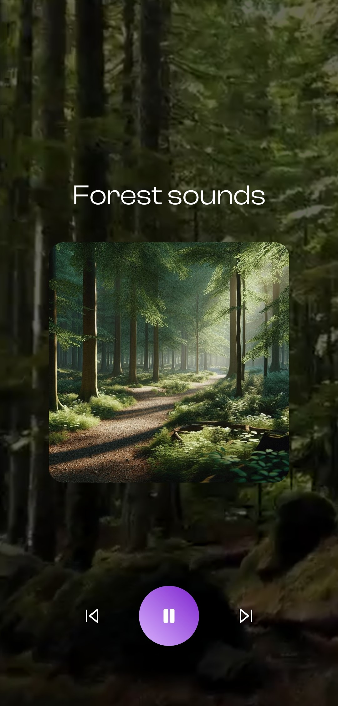

# Calm Music 🎵🌿

## Overview 🌟

**Calm Music** is a mobile application built with React Native, utilizing Tailwind CSS for styling and Expo for streamlined development. The app leverages Appwrite for storage and database management, providing a seamless experience for playing various calming sounds like forest, wind, ocean, fire, and rain.

## Technologies Used 🛠️

- **React Native**: For building the mobile application.
- **Expo**: For a smooth development workflow and easy deployment.
- **Tailwind CSS**: For utility-first CSS styling.
- **Appwrite**: For backend services, including storage and database management.
- **TrackPlayer**: For advanced audio playback capabilities.
- **Lottie**: For animations and visual effects.

## Screenshots 📸

  
  
  

## Contact 🚀

For any inquiries or issues, please contact **anonymous00400@gmail.com**.

